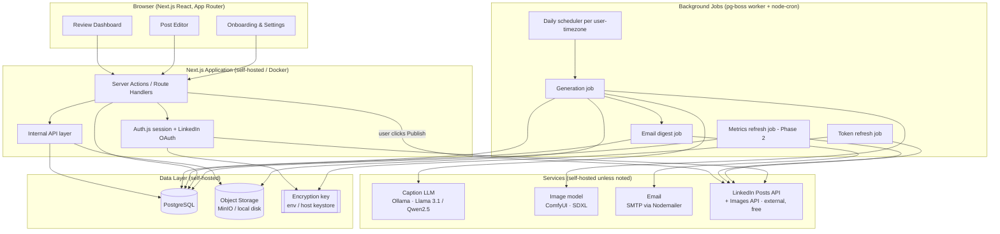

# 1. System Architecture

> **In plain terms:** This describes the moving parts of the system and how a post travels
> from "an idea the computer found" to "live on LinkedIn." Think of it as a factory line:
> one end discovers topics, the middle builds the post, then it waits on a shelf for the
> human to inspect and approve before it ships.

---

## 1.1 The five stages (data flow)

```
   ┌────────────────────────────────────────────────────────────────────────────┐
   │                          ONE POST'S LIFE CYCLE                               │
   └────────────────────────────────────────────────────────────────────────────┘

  (1) DISCOVERY            (2) GENERATION           (3) STORAGE
  ───────────────         ──────────────────       ───────────────
  Expertise profile  ─┐    Topic ─► LLM caption     Draft post row
  Niche/industry      ├──► (hook+body+CTA+tags) ──► + image asset  ──┐
  User's own past     │    Topic ─► Image model      + metadata       │
  posts (pasted/      │         (local SDXL)        in PostgreSQL      │
  uploaded export)   ─┘                              + object storage  │
                                                                       │
                                                                       ▼
  (5) PUBLISHING            (4) REVIEW (human gate)   DAILY EMAIL
  ────────────────         ──────────────────────    ───────────────
  Posts API (w_member_  ◄──  User edits caption/      "Today's post is
  social) writes to         image/format on the        ready" digest
  LinkedIn  ◄── click ──     dashboard, then clicks    with preview +
  "Publish"                  PUBLISH (mandatory)        deep link
       │
       ▼
  Publish log + (later) performance metrics
```

**The gate (stage 4) is the heart of the product.** Stages 1–3 run unattended on a schedule.
Stage 5 can *only* be entered by an authenticated user performing an explicit action against
a draft that is in an approvable state. No code path auto-advances a draft to "published."

---

## 1.2 Component diagram (Mermaid)



---

## 1.3 Runtime model — three execution surfaces

The system has three distinct places where code runs. Keeping them separate is the key
architectural decision.

| Surface | Runs | Examples | Why separate |
|---------|------|----------|--------------|
| **Request/response (Next.js)** | On user action | Load dashboard, save edit, click Publish | Must be fast, interactive, authenticated per request |
| **Background jobs (durable queue)** | On schedule or trigger | Daily generation, send email, refresh tokens, pull metrics | Long-running, retryable, runs without a user present |
| **Local inference + APIs** | On call | LinkedIn (external), local LLM/image, SMTP | Can fail/queue; always wrapped in adapters with retry + backoff |

> **Why a separate job system?**
> Generating a post (LLM call + image generation + upload) can take from seconds to a few
> minutes on local hardware and must retry on partial failure. A durable job runner gives
> per-step retries, fan-out per user, and timezone-aware scheduling. The recommended choice
> is **pg-boss** (a queue that lives inside the existing Postgres — no extra service, no
> cost; see [Tech Stack §5.4](05-tech-stack.md#54-why-pg-boss-for-jobs-instead-of-a-paid-job-runner)),
> with **node-cron** firing the daily scheduler. The worker runs as its own process beside
> the web app in the same Docker stack.

---

## 1.4 Request-path vs. job-path responsibilities

**Background job path (no human present):**
1. Scheduler fires per user at their configured local posting-prep time.
2. Generation job selects/derives a topic (Content Discovery).
3. Generation job calls the LLM for the caption, then the image model for the visual.
4. Image is uploaded to object storage; a `posts` row + `post_images` row are created in
   status `in_review`.
5. Email digest job renders a preview and sends the daily notification; an `email_logs` row
   records it.

**Request path (human present):**
1. User authenticates (Auth.js session).
2. Dashboard reads that user's `in_review` / `draft` posts (scoped by `user_id`).
3. Editor mutations write `post_revisions` and update the `posts` row.
4. **Publish action**: validates the post is in an approvable state and owned by the user,
   then synchronously (or via a short-lived publish job) calls the LinkedIn Posts API,
   writes a `publish_logs` row, and flips status to `published` or `failed`.

---

## 1.5 Failure & resilience model

| Failure | Behavior |
|---------|----------|
| LLM call fails | Job retries with backoff; after N attempts, post saved as `generation_failed`; email notes "we couldn't generate today — tap to retry" |
| Image generation fails | Caption still saved; image marked `failed`; user can regenerate or publish text-only |
| Email send fails | Retried; dashboard still shows the ready post regardless of email |
| LinkedIn publish returns 429 (rate limit) | Honor `Retry-After`; surface "LinkedIn is rate-limiting; try again shortly" to the user; never silently drop |
| LinkedIn token expired | Publish blocked with a clear "Reconnect LinkedIn" CTA; token refresh job attempts proactive renewal |
| Partial publish (post created, metrics fetch later fails) | Publish still considered successful; metrics are best-effort |

**Idempotency:** every generation job carries a deterministic key
(`user_id + scheduled_date`) so a retried or duplicated run never creates two posts for the
same day. The publish action uses a per-post lock + status check so a double-click can't
double-post.

---

## 1.6 Scaling notes (built for one, ready for many)

- **Multi-tenant from day one:** every table is keyed by `user_id`; all queries are scoped;
  Postgres Row-Level Security (or rigorous app-layer scoping) enforces isolation.
- **Per-user scheduling:** the scheduler fans out one generation job per active user; adding
  users adds jobs, not architecture.
- **Stateless app tier:** the Next.js app holds no per-user state between requests, so it
  scales horizontally (run more app containers behind a load balancer). The GPU/inference
  tier (Ollama/ComfyUI) scales separately as a shared pool the worker queues against.
- **Storage separation:** images in object storage (cheap, CDN-backed), metadata in
  Postgres (queryable). Never store image binaries in the database.
- **Future analytics:** the `post_metrics` table and a metrics-refresh job are stubbed in
  the schema so analytics is an additive feature, not a migration.
